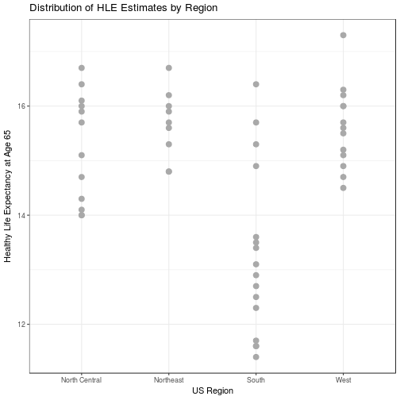

# 创建R包学习教程

内容源自《R实战》第二版，酌情删改。

<details>
<summary>Table of Contents</summary>

## Table of Contents

* [介绍](#intro)
* [非参分析和npar包](#npar-pkg)
* [开发包](#devel-pkg)
* [创建包的文档](#document-pkg)
* [建立包](#build-pkg)
* [深入学习](#further-reading)


</details>

## <a name="intro"></a>介绍

**技术上，包只不过是一套函数、文档和数据的合集，以一种标准的格式保存**。包让你能以一种定义良好的完整文档化方式来组织你的函数，而且便于你将程序分享给他人。

下面是几条我们可能想要创建包的理由：

- 让一套常用函数及其使用说明文档更加容易取用。
- 创造一个能解决重要分析问题（比如对缺失值的插值）的程序（一套相关函数）。

创造一个有用的包也是自我介绍和回馈R社区的好办法，R包可以直接分享或者通过CRAN和Github的在线软件库分享。

这里我们一起来学习如何从头到尾开发一个R包。我们将要开发的包名为`npar`，它提供非参组间比较的函数。如果结果变量是非正态或者异方差的，这套分析技术可以用来比较两组或多个组。这是分析师经常遇到的一个问题。

请使用以下代码下载包，然后保存到你现在的工作目录，接着把它安装到默认的R库当中。

```R
pkg <- "npar_1.0.tar.gz"
loc <- "http://www.statmethods.net/RiA"
url <- paste(loc, pkg, sep="/")
download.file(url, pkg)
install.packages(pkg, repos = NULL, type = "source")
```

在接下来的内容中，我们将把`npar`包当做一个测试的地方，描述和展示它的功能特性和函数。然后接着我们从头开始创建包。

## <a name="npar-pkg"></a>非参分析和npar包

**非参分析**是一种数据分析方法，它在传统参数分析的假设（比如正态性和同方差）不成立的情况下特别有用。这里我们会着重比较两组间或多组相互独立的数值结果变量的方法。

我们对`npar`包中的`life`数据集进行探究，它提供了对2007-2009年美国每个州65岁人的健康预期寿命（Healthy Life Expectancy, HLE）。估计值分别针对男性（`hlem`）和女性(`hlef`)。

数据集也提供了一个名为`region`（地区）的变量，此变量分为东北部、中北部、南部和西部。我从R标准安装中的`state.region`数据框中提取该变量并添加到所关注的数据集中。

假设我们想指导女性的HLE估计值是否在不同地区有显著的不同，一种方式是使用单因素方差分析，不过方差分析假设结果变量时正态分布的，并且不同地区之间的方差是同质的，让我们对这两个假设进行检查。

女性的HLE估值的分布可以用直方图来可视化。


```r
library(npar)
hist(life$hlef, xlab="Healthy Life Expectancy (years) at Age 65",
     main="Distribution of Healthy Life Expectancy for women",
     col="grey", breaks = 10)
```



上图可以看出因变量是负偏的，较低的值数量较少。

不同地区的HLE分数的方差可以用并排点图来可视化：


```r
library(ggplot2)
ggplot(data=life, aes(x=region, y=hlef)) + 
    geom_point(size=3, color="darkgrey") + 
    labs(title="Distribution of HLE Estimates by Region",
         x="US Region", y="Healthy Life Expectancy at Age 65") + 
    theme_bw()
```


上图中的每个点代表一个州，每个地区的方差都有所不同，东北部和南部的方差差异最大。

## <a name="devel-pkg"></a>开发包

## <a name="document-pkg"></a>创建包的文档

## <a name="build-pkg"></a>建立包

## <a name="further-reading"></a>深入学习

